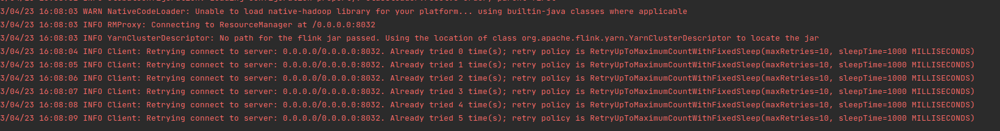

# flink-submitter-api

[](README_zh_CN.md)
[](README.md)
## 1. introduction

This project can help you to submit,query,kill flink task in java api.

## 2. Support mode

- Flink local
- Flink remote
- Flink yarn session
- Flink yarn per job

## 3. Necessary

Flink environment is necessary when you submit and kill flink task

```java
class FlinkInfo(val flinkHome: String) extends Serializable {


  private[this] lazy val FLINK_SCALA_VERSION_PATTERN: Pattern = Pattern.compile("^flink-dist_(.*)-(.*).jar$")


  lazy val fullVersion: String = s"${version}_$scalaVersion"


  /**
   * get scala version
   */
  lazy val scalaVersion: String = {
    val matcher: Matcher = FLINK_SCALA_VERSION_PATTERN.matcher(flinkDistJar.getName)
    matcher.matches()
    matcher.group(1)
  }


  /**
   * get Flink version
   */
  lazy val version: String = {
    val matcher: Matcher = FLINK_SCALA_VERSION_PATTERN.matcher(flinkDistJar.getName)
    matcher.matches()
    matcher.group(2)
  }


  /**
   * get all flink libs
   */
  lazy val flinkLib: File = {
    require(flinkHome != null, "flinkHome can not be null")
    require(new File(flinkHome).exists(), "flinkHome not exist")
    val lib = new File(s"$flinkHome/lib")
    require(lib.exists() && lib.isDirectory, s"$flinkHome/lib should be directory")
    lib
  }


  /**
   * yarn-ship content
   */
  lazy val flinkYarnShipFiles: List[String] = {
    List(flinkLib.toString,s"$flinkHome/plugins",s"$flinkHome/conf/log4j.properties")
  }


  /**
   * get flink distJar
   */
  lazy val flinkDistJar: File = {
    val distJar: Array[File] = flinkLib.listFiles().filter((_: File).getName.matches("flink-dist_.*\\.jar"))
    distJar match {
      case x if x.isEmpty =>
        throw new IllegalArgumentException(s"no flink-dist.jar in $flinkLib")
      case x if x.length > 1 =>
        throw new IllegalArgumentException(s"there are multiple flink-dist.jar in $flinkLib ")
      case _ =>
    }
    distJar.head
  }
}
```


## 4.Remote mode example

### 4.1 submit task

```java
public class FlinkSubmitTest {
    FlinkInfo flinkInfo = new FlinkInfo("/opt/flink-test");
    ResolveOrder resolveOrder = ResolveOrder.of(1);
    String appName = "flink-submit-test";
    String batchMainClass = "com.czl.submitter.FlinkTaskBatch";
    String jarPath = "./jar/flink-task-api-test-1.0.jar";
    List<String> param = Arrays.asList("1","2","3");
    HashMap<String,Object> extraMap = new HashMap<>();
    
    @Test
    void remoteTest() throws URISyntaxException {
        ExecutionMode remoteMode = ExecutionMode.of(1);
        URI activeAddress = new URI("http://ip:port/");
        extraMap.put(RestOptions.ADDRESS.key(), activeAddress.getHost());
        extraMap.put(RestOptions.PORT.key(), activeAddress.getPort());
        FlinkSubmitRequest remoteSubmit = new FlinkSubmitRequest(
                flinkInfo,
                remoteMode,
                resolveOrder,
                appName,
                batchMainClass,
                jarPath,
                null,
                1,
                param,
                extraMap);
        FlinkSubmitResponse submit = FlinkSubmitter.submit(remoteSubmit);
        System.out.println(submit.jobId());
    }
}
```

### 4.2 query task

```java
public class FlinkQueryTest {
    @Test
    void remoteQuery() {
        String master = "http://ip:port";
        String jobId = "e0641a4f9f060961419531dd5233fe6c";
        FlinkQueryRequest request = new FlinkQueryRequest(ExecutionMode.REMOTE, master, jobId);
        FlinkQueryResponse query = FlinkSubmitter.query(request);
        System.out.println(query);
    }
}

```

### 4.3 stop task

```java
public class FlinkStopTest {
    FlinkInfo flinkInfo = new FlinkInfo("/opt/flink-test");
    String customSavePoint = "./sp/";
    Map<String, Object> extraParameter = new HashMap<>(0);

    @Test
    void remoteStop() throws URISyntaxException {
        ExecutionMode remote = ExecutionMode.REMOTE;
        URI activeAddress = new URI("http://ip:port/");
        extraParameter.put(RestOptions.ADDRESS.key(), activeAddress.getHost());
        extraParameter.put(RestOptions.PORT.key(), activeAddress.getPort());
        FlinkStopRequest request = new FlinkStopRequest(flinkInfo,
                remote,
                null,
                "e0641a4f9f060961419531dd5233fe6c",
                true,
                customSavePoint,
                false, extraParameter);
        FlinkStopResponse stop = FlinkSubmitter.stop(request);
        System.out.println(stop.savePointPath());
    }
}
```

### 4.4 deploy and shutdown yarn session

```java
public class YarnSessionTest {
    @Test
    void deploy(){
        FlinkInfo flinkInfo = new FlinkInfo("/opt/flink-test");
        FlinkDeployRequest deployRequest = new FlinkDeployRequest(flinkInfo, "czl-yarn-session-test");
        FlinkDeployResponse flinkDeployResponse = YarnSessionSubmit.deployYarnSession(deployRequest);
        System.out.println(flinkDeployResponse.address());
        System.out.println(flinkDeployResponse.clusterId());
    }


    @Test
    void shutdown(){
        FlinkInfo flinkInfo = new FlinkInfo("/opt/flink-test");
        FlinkShutdownRequest shutdownRequest = new FlinkShutdownRequest(flinkInfo, "application_1668191242058_0072");
        YarnSessionSubmit.shutDownYarnSession(shutdownRequest);
    }
}
```


## 5 problem

if you can not connect to the yarn，put `hdfs-site.xml`,`yarn-site.xml`,` core-site.xml ` and `worker` in `resources` 。
